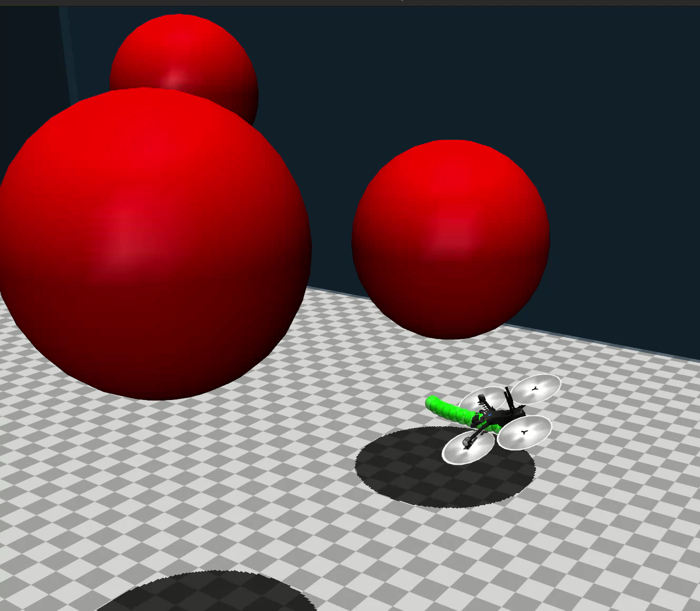

# Predictive Safety Filtering for a Quadrotor in MuJoCo

A MuJoCo simulation of a quadrotor safety filter. A nominal keyboard-controlled PD policy acts as a stand-in for an agent policy; a finite-horizon Predictive Safety Filter (PSF) predicts the drone's nonlinear motion and modifies the requested motor commands when the predicted trajectory approaches the workspace boundary or an obstacle.



The green points show the position sequence predicted by the filter.

## Quick start

Requires Python 3.10 or later, a graphical desktop, and Tkinter.

```bash
git clone https://github.com/darrenbiskupphd/psf-droneracing-mujoco.git
cd psf-droneracing-mujoco

python -m venv .venv
source .venv/bin/activate              # Windows: .venv\Scripts\activate
python -m pip install -r requirements.txt
python main.py
```

On Linux, Tkinter may need to be installed through the system package manager (for example, `python3-tk`). JAX performs an initial compilation/warm-up when the program starts. The simulation requires a display because it opens both a MuJoCo viewer and a small control window.

## Controls

The control window must have focus.

| Input | Effect |
|---|---|
| `W` / `S` | Pitch request |
| `A` / `D` | Roll request |
| `Q` / `E` | Yaw-rate request |
| `Space` / `Shift` | Climb / descend request |
| `F` | Toggle the predictive safety filter |
| `C` | Toggle the chase camera |

The PSF starts disabled. With it enabled, the program plots nominal and filtered motor commands after the simulation is closed.

## Architecture

| File | Role |
|---|---|
| `main.py` | MuJoCo loop, state extraction, controller/filter handoff, and logging |
| `x2_race.xml` | Quadrotor model, actuators, workspace, obstacles, and visualization sites |
| `state.py` | `DroneState` data contract and quaternion-to-Euler conversion |
| `controllers/input_shaper.py` | Keyboard input to attitude/velocity setpoints |
| `controllers/pd_controller.py` | Nominal PD controller and four-motor mixer |
| `controllers/gui.py` | Tkinter control panel |
| `safety/x2_psf_jax.py` | Nonlinear rollout, constraints, JAX derivatives, and SLSQP solve |

MuJoCo advances the plant at `1 kHz`. The nominal controller and PSF run at `100 Hz`; the same motor command is held between controller updates.

## Control and prediction model

The nominal controller maps desired roll, pitch, vertical velocity, and yaw rate to a total thrust and body torques, then uses the rotor geometry to compute four motor commands. The PSF uses a related 12-state rigid-body model:

$$
 x = [p, v, \Theta, \omega], \qquad \dot p = v,
$$
$$
 \dot v = \begin{bmatrix}0\\0\\-g\end{bmatrix}
 + \frac{1}{m}R(\Theta)\begin{bmatrix}0\\0\\\sum_i u_i\end{bmatrix},
 \qquad \dot\Theta = W(\Theta)\omega,
$$
$$
 \dot\omega = J^{-1}\left(M_\tau u - \omega \times (J\omega)\right).
$$

Here, `p` and `v` are world-frame position and velocity, `\Theta` contains roll/pitch/yaw, `\omega` is body-frame angular rate, `R` maps body thrust into world coordinates, and `M_\tau` maps rotor thrusts to body torques. The prediction model is intentionally simpler than the full MuJoCo contact/physics update.

At each control step, the filter solves a constrained finite-horizon problem:

$$
\min_{U_{0:N-1}} \; \lVert u_0 - u_{\mathrm{nom}} \rVert_2^2
$$

subject to the predicted dynamics, `0 <= u_k <= 13`, workspace clearance, and obstacle clearance:

$$
\lVert p_k - c_i \rVert_2 \ge r_{\mathrm{drone}} + r_i.
$$

Only the first optimized action is applied; the horizon is replanned at the next update. The implementation uses `N=10` prediction steps at `dt=0.03 s` (`0.3 s` total horizon), fourth-order Runge–Kutta integration, JAX for compiled rollouts and derivatives, and SciPy's SLSQP optimizer. This JAX/SciPy combination is a deliberately compact and inspectable class-project implementation: it avoids a larger solver stack while making repeated nonlinear evaluations practical in Python. The `0.03 s` prediction step is a discretization choice, not the `0.01 s` command-hold interval: smaller steps improve local fidelity but shorten the lookahead for a fixed `N`, while longer horizons increase solve time.

The objective is intentionally simple. Since the problem is replanned every control step, the filter seeks the closest feasible first action to the nominal command; it does not add an extra smoothness or future-input penalty.

## Scope and limitations

This is a simulation study of a **practical finite-horizon safety filter**, not a formal safety guarantee. The current constraints cover motor limits, the bounded workspace, and three spherical obstacles. Attitude, velocity, motor slew-rate, contact, uncertainty, and model-mismatch constraints are not included. The geometric margin and prediction model are approximations of the MuJoCo vehicle.

The keyboard controller is a visible stand-in for a learned or agent policy; no RL policy is included. The green goal sphere in the XML is visual only and is not used for navigation or optimization. The current control loop is synchronous, so solver time is part of the simulation's real-time budget rather than being handled by a separate asynchronous planning thread.

## Reference

The safety-filter formulation is based on the ideas in *A Predictive Safety Filter for Learning-Based Control of Constrained Nonlinear Dynamical Systems*.

## License

Source code is released under the [MIT License](LICENSE). The included vehicle mesh and texture may have separate upstream provenance; check their terms before redistributing them independently.
